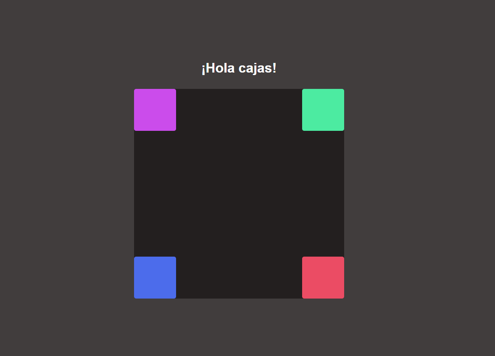

## Practica position en css🎨

En este repositorio , encontraras unos pequeños ejercicios para practicar la propiedad position de css y ordenar tus "cajas" en el sitio que necesites

Encontrarás una carpeta con un pdf con el planteamiento de los ejercicios
y las soluciones la carpeta de styles.

`position:`

 >   `static;` es el valor por defecto. Un elemento con position: static; no está posicionado en ninguna forma en específico

 >  `absolut;`  podemos determinar su posición `top:50%`  `left:0px`  posiciona relativo a el documento completo

> `relative` va a moverlo relativo a su padre, si no tiene nadie por encima será el documento

> `fixed;` se queda fijo en la pantalla siempre, no en el documento, da igual que hagas scroll se queda fijo en la misma posición siempre viewport.

>`sticky;` se queda fijo hasta que termina su contenedor padre y entonces se va con el y deja de estar fijo.